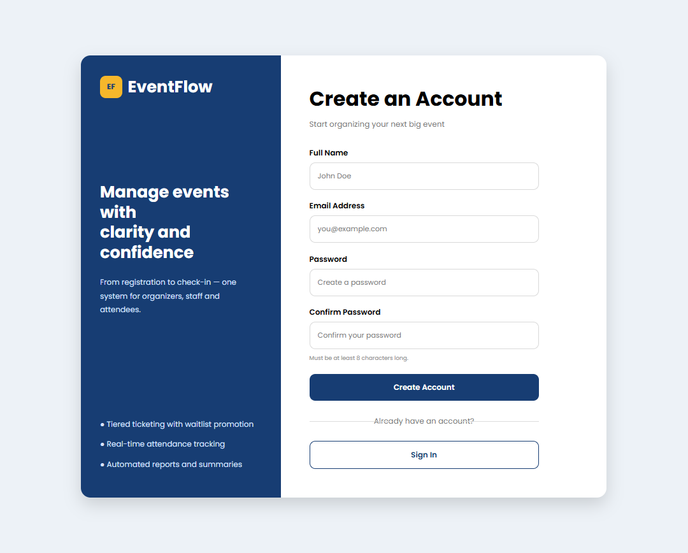
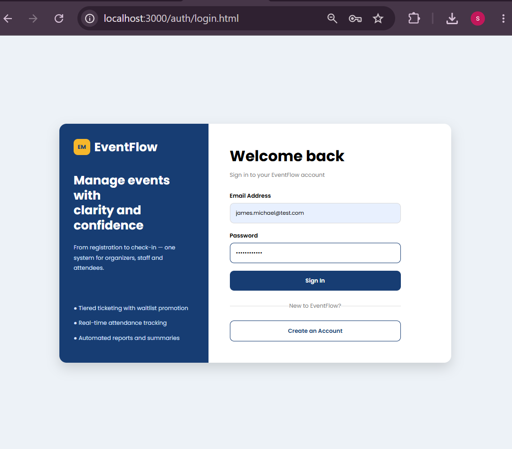
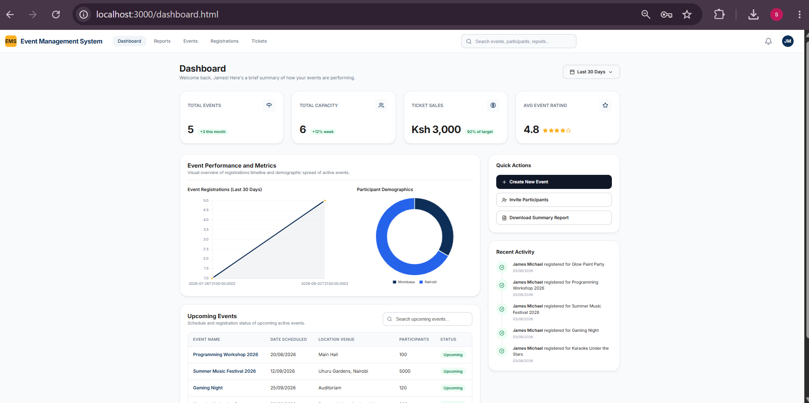
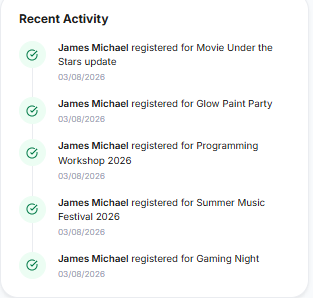

# 🎉 Event Management System

## 📖 Project Description

The **Event Management System (EMS)** is a web-based application designed to simplify the organization and management of events. The system enables administrators to create, update, view, and delete events, while participants can browse available events, register, and automatically receive a ticket upon successful registration.

The project was developed as a collaborative university group project using a full-stack web development approach.

---

## ✨ Features

### Administrator
- User Authentication
- Dashboard with event statistics
- Create new events
- View event details
- Edit existing events
- Delete events
- Generate reports
- Monitor attendance and recent activity

### Participant
- Register an account
- Login securely
- Browse available events
- Register for events
- Prevent duplicate registrations
- Generate event tickets
- Print tickets

---

## 🛠 Technologies Used

- HTML5
- CSS3
- JavaScript (ES6)
- Node.js
- Express.js
- MySQL
- XAMPP

---

## 👥 Team Members

| Member | Responsibility |
|---------|----------------|
| Lulimu Bradley | Authentication |
| Sandra Kinoti | Event Management |
| Shatreez Okutoyi | Registration & Tickets |
| John Wek | Dashboard & Reports |
| Enoch Arisa | Database & Integration |

---

## 📂 Folder Structure

```
EventManagementSystem/
│
├── assets/
├── database/
├── docs/
├── pages/
├── screenshots/
├── server/
├── dashboard/
├── dashboard.html
├── dashboard.css
├── dashboard.js
├── reports.html
├── package.json
└── README.md
```

---

# 📸 System Walkthrough

## 1. User Registration



---

## 2. Successful User Registration


---

## 3. Login Page



---

## 4. Successful Login


---

## 5. Dashboard



---

## 6. Updated Dashboard


---

## 7. User Profile


---

## 8. Create New Event


---

## 9. Event Created Successfully


---

## 10. Events Page


---

## 11. View Event Details


---

## 12. Edit Event


---

## 13. Event Updated Successfully


---

## 14. Delete Event


---

## 15. Event Registration


---

## 16. Successful Ticket Registration


---

## 17. Registration Confirmation


---

## 18. Print Ticket


---

## 19. Reports Dashboard


---

## 20. Attendance Rate


---

## 21. Events Summary


---

## 22. Upcoming Events


---

## 23. Recent Activity



---

## 📊 Dashboard & Reports Module

The Dashboard and Reports module provides:

- Event statistics overview
- Attendance analytics
- Recent activity monitoring
- Upcoming events
- Report generation
- Responsive dashboard interface

---

## 🔀 GitHub Workflow

- Create a feature branch.
- Work only on your assigned module.
- Commit changes regularly.
- Push your branch to GitHub.
- Open a Pull Request before merging into `main`.

---

## 🚀 Future Improvements

- Email ticket delivery
- QR Code ticket validation
- Event search and filtering
- Payment gateway integration
- Attendance check-in using QR codes
- Event reminders via email

---

## 📄 License

This project was developed for educational purposes as part of a university coursework project.
